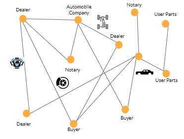

# Automobile Market - TokenSDK

This Cordapp shows simple flows related to the token SDK. In this Cordapp, we will mimic a automobile buying and selling market with 5 standard parties: 
- Notary
- AutomobileCo
- LicensedDealership
- UsedPartsAgency
- Buyer



From the above chart we see that Tokens are representing the ownership and status of the physical assets ( [Chassis, Body, Engine, Transmission, Braking, Interior] ). A key point to notice here is that **a automobile is represented with 6 tokens ([Chassis, Body, Engine, Transmission, Braking, Interior])**. This is designed in the way to be flexible to sell or total a specific part of your automobile. As you can see, this automobile buying/selling market is capable of mimicking multiple business logics. We will be demonstrating one of the possible logic here:

1. Automobile Company manufactures the automobiles
2. Automobile Company can sell the automobile to licensed dealer and buyers. 
3. Used parts agency can get the used automobile parts from the licensed dealer or buyers. 
4. When there is a need to total the physical automobile part, the current owner of the physical part will redeem the token with the AutomobileCo

Through out the app, you can see how to create, transact, and redeem a token. 


Once you have cloned this Git repository, you are ready to run this app.

First deploy and run the Corda node network:

```
./gradlew deployNodes
./build/nodes/runnodes
```
Be patient while Corda is setting nodes. If you have any questions during setup of your Corda node netword, please go to https://docs.corda.net/getting-set-up.html for detailed setup instructions.

Next, if you wish to interact with the system via the browser, run the Spring Boot app to make available the Restful APIs:

```
./gradlew run
``` 

To access the APIs in your browser:

```
http://localhost:/swagger-ui/
```

Once all 5 nodes are started up either choose a node shell and run: 

```
flow start CreateChassisToken chassisSerial: 4153
flow start CreateBodyToken bodySerial: 5559
flow start CreateEngineToken engineSerial: 5742
flow start CreateTransmissionToken transmissionSerial: 9876
flow start CreateBrakingToken brakingSerial: 5245
flow start CreateInteriorToken interiorSerial: 2524
```

OR from the browser:

```
http://localhost:8011/swagger-ui/#/corda-admin-rest-controller/bulkCreateTokensUsingPUT
```
and supply the ids and the target party to create the tokens on.


After this step, you have created 6 tokens representing the physical automobile part with unique serial numbers(which will be unique in the manufacturing).
 
Then either from the same node shell run:

```
flow start IssueNewAutomobile  chassisSerial: 4153,  bodySerial: 5559,  engineSerial: 5742,  transmissionSerial: 9876,  brakingSerial: 5245,  interiorSerial: 2524,  holder: LicensedDealership
```
Substitute the __LicensedDealership__ with the name of the node you are in.

OR from the browser:

```
http://localhost:8011/swagger-ui/#/corda-admin-rest-controller/issueNewAutomobileUsingPUT
```

and again supply the 2524s and the target party to issue the tokens to/

This will transfer the 6 tokens together to represent a single automobile) to the targeted party. 

Now we can see we did receive the tokens at targeted node shell by either running the following within that shell: 

```
run vaultQuery contractStateType: com.r3.corda.lib.tokens.contracts.states.EvolvableTokenType
```

OR from the browser:

```
http://localhost:8011/swagger-ui/#/corda-admin-rest-controller/vaultQueryUsingGET
```
and select the targeted Party.

Continue to the business flow, the targeted Party will sell the automobile to the another Party (call them the Buyer)  

Either run from within the Buyer Party node: 

```
flow start TransferAutomobileToken  chassisSerial: 4153,  bodySerial: 5559,  engineSerial: 5742,  transmissionSerial: 9876,  brakingSerial: 5245,  interiorSerial: 2524,  holder: Buyer
```
where Buyer here is the name of the node Party you are considering the actual buyer.

OR

from the browser:

```
http://localhost:8011/swagger-ui/#/braking-token-command-rest-controller/transferTokenUsingPOST_1
```

Substitute the name of your part for the word __braking__ in the URL. Enter the part's 2524 and the destination Party.  


Now we can check at the target Party ("Buyer") node shell to see if the buyer receives the token by running the same `vaultQuery` we just ran at the source Party ("Seller") shell. 

At the Buyer side, we would assume we got a recall notice and will send the physical automobile back to the manufacturer. The action will happen in real life, but on the ledger we will also need to "destroy"(process of redeem in Corda TokenSDK) the chassis token. Run:

```
flow start TotalPart part: chassis, serial: 4153
```

OR from the browser, for individual part destroying:

```
http://localhost:8011/swagger-ui/#/braking-token-command-rest-controller/destroyTokenUsingDELETE_1
```

Substitute the name of your part for the word __braking__ in the URL

OR for bulk destroying:

```
http://localhost:8011/swagger-ui/#/corda-admin-rest-controller/bulkDestroyTokensUsingDELETE
```

and enter values for the ${identiferFieldName} for the parts to transfer and select the targeted Party.

At the buyer's shell or from the browser, if we do the [vaultQuery](https://docs.corda.net/docs/corda-os/api-vault-query.html#api-vault-query) again, we will see we now have all but the chassis tokens. With the remaining tokens, we can sell the remaining parts to the another party ("User Parts Agency"). We will achieve it by either running: 

```
flow start TransferPartToken part  bodySerial: 5559,  holder: UsedPartsAgency
flow start TransferPartToken part  engineSerial: 5742,  holder: UsedPartsAgency
flow start TransferPartToken part  transmissionSerial: 9876,  holder: UsedPartsAgency
flow start TransferPartToken part  brakingSerial: 5245,  holder: UsedPartsAgency
flow start TransferPartToken part  interiorSerial: 2524,  holder: UsedPartsAgency
```

OR from the browser for individual part transfer:

```
http://localhost:8011/swagger-ui/#/chassis-token-command-rest-controller/transferTokenUsingPOST_2
```

OR from the browser for bulk part transfer:
```
http://localhost:8011/swagger-ui/#/corda-admin-rest-controller/bulkTransferTokensUsingPOST
```

and enter values for the ${identiferFieldName} for the parts to transfer and select the targeted Party.

At the end of the flow logic, we will find the chassis token is destroyed and the used parts agency holds the remaining parts tokens. 


